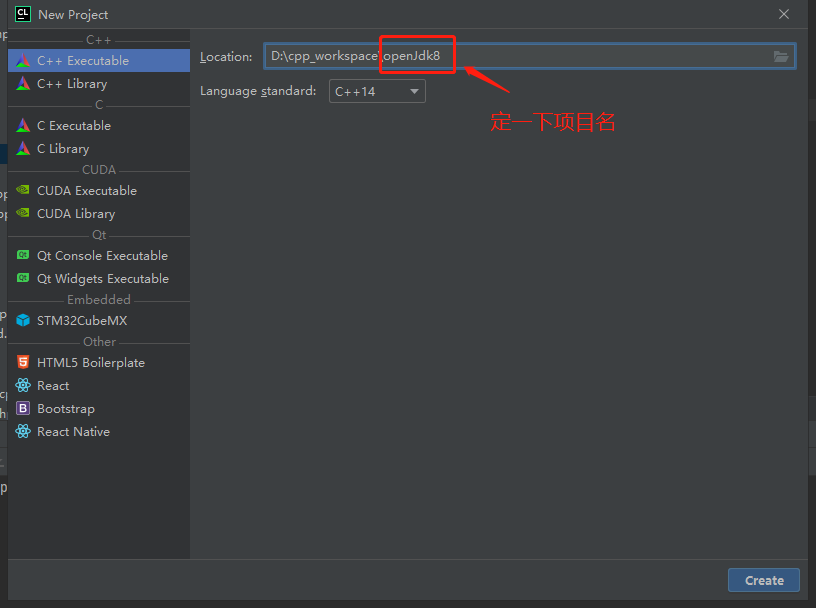
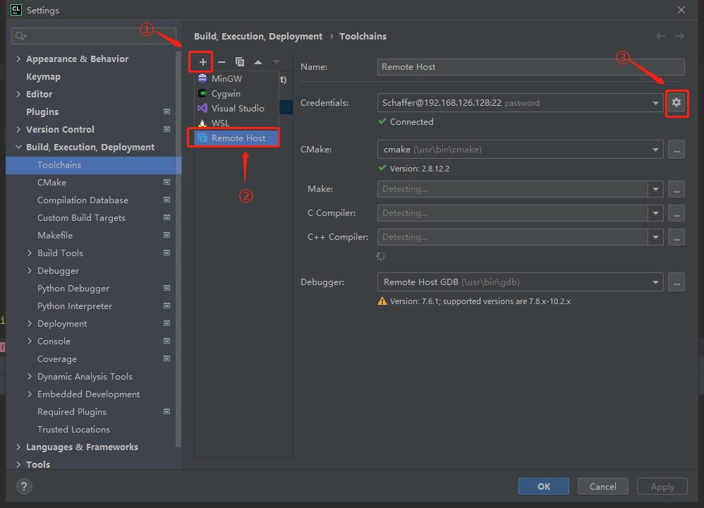

# 编译(compile)和调试(debug)OpenJdk8
## 编译
### 环境准备

本次编译OpenJdk使用的操作系统镜像为CentOS-7-x86_64-DVD-1810.iso

操作系统选的最小安装

    cat /proc/version 

    Linux version 3.10.0-957.el7.x86_64 (mockbuild@kbuilder.bsys.centos.org) (gcc version 4.8.5 20150623 (Red Hat 4.8.5-36) (GCC) ) #1 SMP Thu Nov 8 23:39:32 UTC 2018  

安装java环境（java8_202）

    java -version

    java version "1.8.0_202"
    Java(TM) SE Runtime Environment (build 1.8.0_202-b08)
    Java HotSpot(TM) 64-Bit Server VM (build 25.202-b08, mixed mode)

下载将要编译的OpenJdk源码 https://github.com/openjdk/jdk/tree/jdk8-b120  
建议使用国内镜像或者是仅下载该tag代码的zip包，clone的时候也可增加参数depth=1，直接clone速度会非常慢

我使用的是方法是下载该tag代码的zip包  
然后解压

### 编译前检查
解压后进入解压后的文件夹jdk-jdk8-b120，进行编译前的准备工作

    ./configure --with-debug-level=slowdebug --enable-debug-symbols ZIP_DEBUGINFO_FILES=0

过程可能提示未安装以下软件，可以在执行configure脚本前安装也可以在执行报错后安装：

    yum install unzip
    yum install zip
    yum groupinstall "Development Tools"
    yum install libXtst-devel libXt-devel libXrender-devel
    yum install cups-devel
    yum install freetype-devel
    yum install alsa-lib-devel
    yum install epel-release（非必须）
    yum install ccache（非必须）
执行完configure显示successful就可以开始编译了

    ====================================================
    A new configuration has been successfully created in
    /home/Schaffer/jdk-jdk8-b120/build/linux-x86_64-normal-server-slowdebug
    using configure arguments '--with-debug-level=slowdebug --enable-debug-symbols ZIP_DEBUGINFO_FILES=0'.

    Configuration summary:
    * Debug level:    slowdebug
    * JDK variant:    normal
    * JVM variants:   server
    * OpenJDK target: OS: linux, CPU architecture: x86, address length: 64

    Tools summary:
    * Boot JDK:       java version "1.8.0_202" Java(TM) SE Runtime Environment (build 1.8.0_202-b08) Java HotSpot(TM) 64-Bit Server VM (build 25.202-b08, mixed mode)  (at /home/Schaffer/jdk1.8.0_202)
    * C Compiler:     gcc (GCC) 4.8.5 20150623 (Red Hat-44) version 4.8.5-44) (at /usr/bin/gcc)
    * C++ Compiler:   g++ (GCC) 4.8.5 20150623 (Red Hat-44) version 4.8.5-44) (at /usr/bin/g++)

    Build performance summary:
    * Cores to use:   1
    * Memory limit:   972 MB
    * ccache status:  installed, but disabled (version older than 3.1.4)

### 进行编译 

    make all ZIP_DEBUGINFO_FILES=0
编译nashorn过程可能会报错

    Running nasgen Exception in thread "main" java.lang.VerifyError: class jdk.nashorn.internal.objects.ScriptFunctionImpl overrides final method setPrototype.(Ljava/lang/Object;)V
修改./nashorn/make/BuildNashorn.gmk第80行  
-cp 修改为-Xbootclasspath/p:  
-cp后有空格，修改后无空格

    -cp "$(NASHORN_OUTPUTDIR)/nasgen_classes$(PATH_SEP)$(NASHORN_OUTPUTDIR)/nashorn_classes" \
    
    -Xbootclasspath/p:"$(NASHORN_OUTPUTDIR)/nasgen_classes$(PATH_SEP)$(NASHORN_OUTPUTDIR)/nashorn_classes" \
编译成功后会显示各个耗时  

    ----- Build times -------
    Start 2021-07-31 04:30:41
    End   2021-07-31 04:54:52
    00:00:44 corba
    00:00:49 demos
    00:03:40 docs
    00:06:30 hotspot
    00:01:27 images
    00:00:26 jaxp
    00:00:37 jaxws
    00:08:53 jdk
    00:00:49 langtools
    00:00:16 nashorn
    00:24:11 TOTAL
    -------------------------
## 调试
由于我的电脑配置不够高，centos是在虚拟机内，没有安装桌面软件，故使用windows远程调试虚拟机的OpenJdk  
因此需要多装一个远程调试工具gdbserver

    yum install gdb-gdbserver
### 环境准备
调试环境  
#### centos：

    vi /etc/yum.repos.d/CentOS-Debuginfo.repo
修改enable=1

    yum install cmake
    yum install glibc
    yum install yum-utils
    debuginfo-install glibc-2.17-324.el7_9.x86_64 libgcc-4.8.5-44.el7.x86_64 libstdc++-4.8.5-44.el7.x86_64

#### windows：
安装ide：clion  
1.File | New Project 新建一个空的C++ executable项目  

2.File | Settings | Build, Execution, Deployment | Toolchains 新增一个Remote Host并点击③配置Credentials

